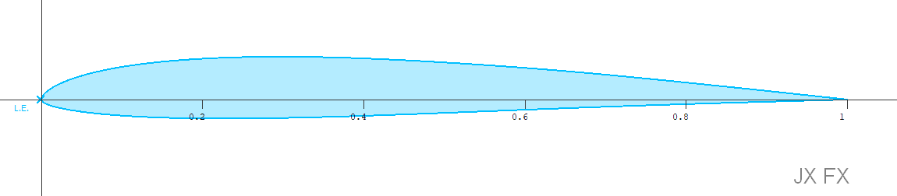

<!-- PROJECT LOGO -->
<br />
<p align="center">
  <a href="https://github.com/jxjo/Xoptfoil">
    
  </a>
</p>

# Xoptfoil-JX

This is Xoptfoil-JX, a fork of Xoptfoil - the amazing airfoil optimizer by Daniel Prosser  


## About the project

The project was started to handle some off the difficulties when it comes to optimize an airfoil having more advanced requirements on the quality of the generated airfoil. 

Main changes and improvements made up to now based on the original Xoptfoil

* Aerodynamic target values for an operating point to ease the final tweaking of an optimization - or to reverse engineer an airfoil from an existing polar.
* Geometric target values to replace optimization based on geometric constraints
* Instead of Hicks Henne shape functions the geometric airfoil parameters thickness, camber and leading edge radius can be used to perform a lightweight and fast optimization
* Support for polar type 1 (fixed speed) and polar type 2 (fixed lift) optimization
* Generation of a complete polar set of the final airfoil to import into xflr5 or flow5 (part of the sub project 'The Strak Machine')
* Minor other modifications in Xoptfoil and visualizer


## Documentation 

The additional options of Xoptfoil-JX compared to the original Xoptfoil are described in [Xoptfoil-JX Reference](https://github.com/jxjo/Xoptfoil/blob/master/Xoptfoil-JX%20Reference.pdf)

Descriptions of some new capabilities can be found in [Xoptfoil-JX Describtion](https://github.com/jxjo/Xoptfoil/blob/master/Xoptfoil-JX%20Describtion.pdf)


## Usage example

The development of a high end F3F airfoil using Xoptfoil-JX is described in the arctivle [Entwicklung eines F3F-Profils](http://www.rc-network.de/forum/showthread.php/769110-Entwicklung-eines-F3F-Profils) - sorry, it's in German.


## Installation

tbd

```sh
tbd
```

## Meta and Contribution

* Initial fork and first modifications by Jochen Guenzel 
* Camber & Tickness based optimization by Matthias Boese and Jochen Guenzel

Feel free to contact us - and of course we are happy for any contributions and suggestions
